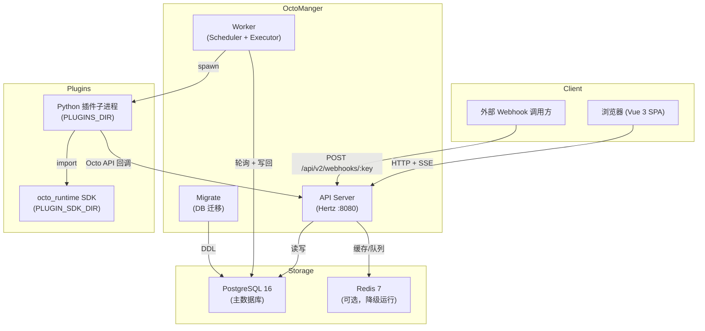
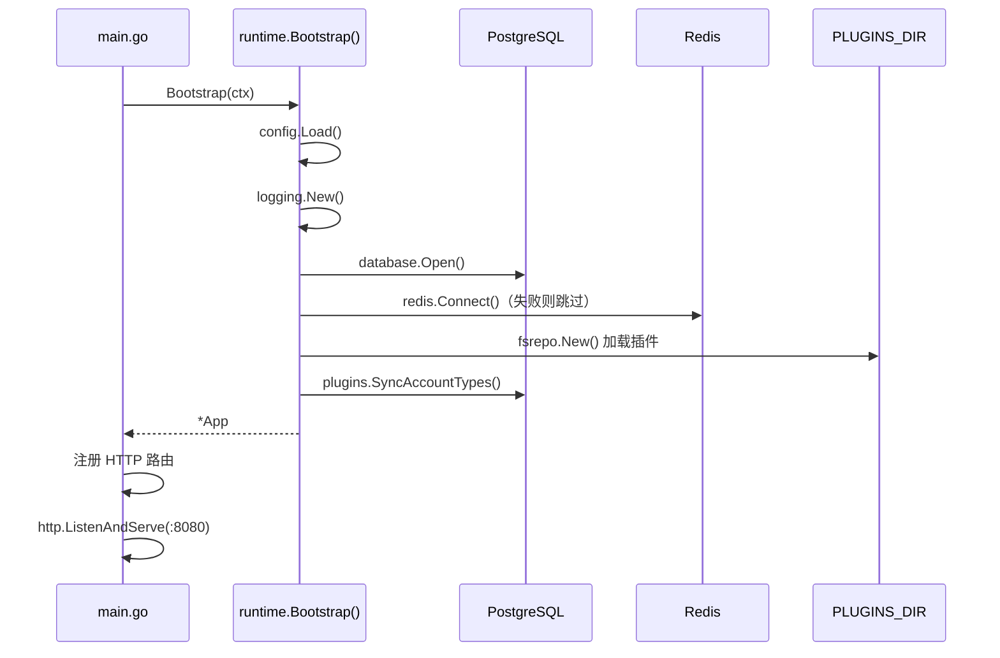
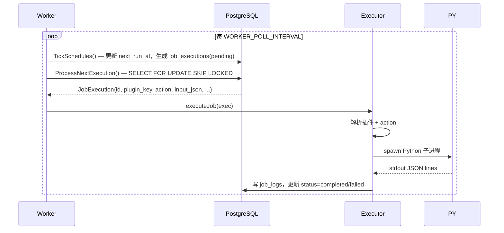
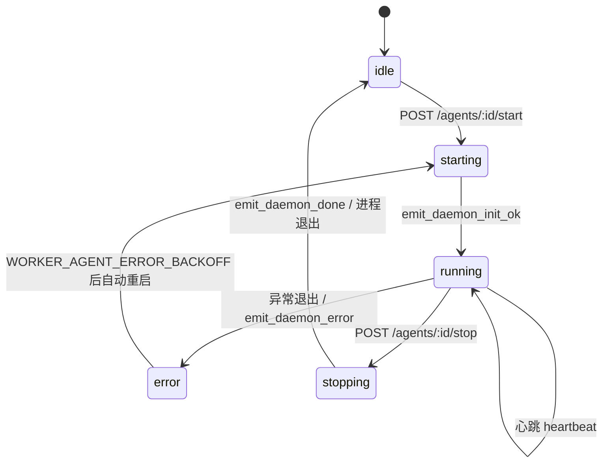
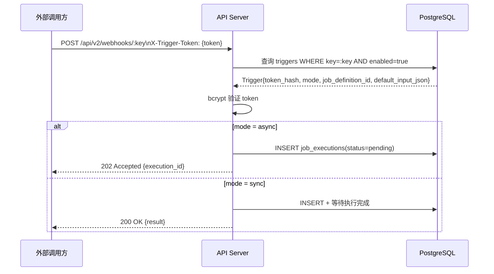
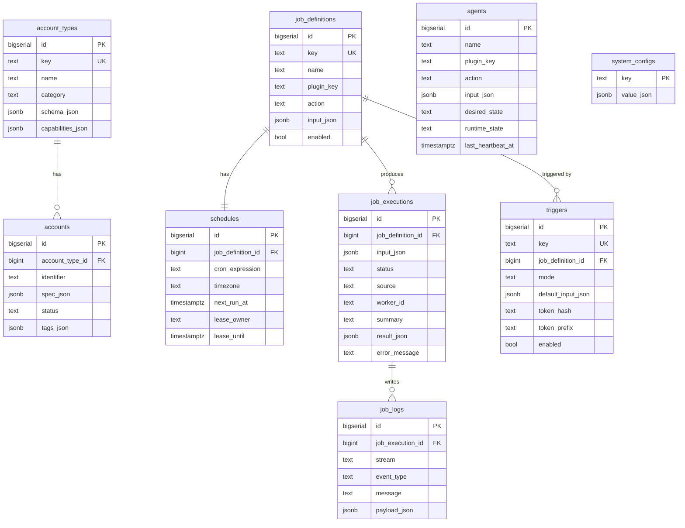

# Architecture

> 本文档面向**贡献者和平台集成者**，描述 OctoManger 的系统设计、数据流与模块边界。

---

## 目录

- [宏观架构](#宏观架构)
- [后端架构：Domain-Driven Design](#后端架构domain-driven-design)
  - [域层结构](#域层结构)
  - [依赖注入容器](#依赖注入容器)
  - [认证机制](#认证机制)
- [任务执行流程](#任务执行流程)
  - [Cron 调度](#cron-调度)
  - [插件子进程执行](#插件子进程执行)
  - [Agent 长驻进程](#agent-长驻进程)
- [Webhook 触发流程](#webhook-触发流程)
- [前端架构](#前端架构)
- [数据库模式](#数据库模式)
- [Worker 配置参考](#worker-配置参考)
- [插件系统详解](#插件系统详解)

---

## 宏观架构



---

## 后端架构：Domain-Driven Design

后端由 **8 个独立业务域**组成，每个域严格遵循四层分离：

```
transport/    → HTTP 处理器（Hertz 路由注册、请求解析、响应序列化）
app/          → 业务逻辑（service.go，跨仓库编排）
domain/       → 核心实体与值对象（types.go，零外部依赖）
infra/postgres/ → GORM 仓库实现（SQL 查询，数据映射）
```

### 域层结构

```
internal/domains/
├── account-types/   账号类型（插件声明的凭证 Schema）
├── accounts/        账号凭证（关联到 account-types）
├── agents/          长驻后台 Agent
├── email/           邮件账号（IMAP / Outlook OAuth）
├── jobs/            任务定义 + Cron 调度 + 执行记录
├── plugins/         插件发现与设置
├── system/          系统状态、看板、键值配置
└── triggers/        Webhook 触发器
```

### 依赖注入容器

所有服务在 `internal/platform/runtime/runtime.go` 中的 `App` 结构体内统一初始化，并注入 HTTP 处理器：

```
Bootstrap() → App{
  Config, Logger, DB, Redis,
  AccountTypes, Accounts, Email,
  Triggers, Plugins, Jobs, Agents, System
}
```

**启动顺序：**



### 认证机制

所有 `[ADMIN]` 标记的端点通过 `internal/platform/auth/middleware.go` 保护：

| 请求头 | 格式 |
|--------|------|
| `X-Admin-Key` | `{key}` |
| `Authorization` | `Bearer {key}` |

> **开发模式**：若 `ADMIN_KEY` 环境变量为空，中间件为 no-op，所有请求均通过；同时兼容旧变量 `X_ADMIN_KEY` / `OCTO_ADMIN_KEY`。

---

## 任务执行流程

### Cron 调度



`schedules` 表使用 `lease_owner` + `lease_until` 实现数据库级分布式锁，防止多 Worker 重复调度。

### 插件子进程执行

```
Worker                    Python 子进程
  │                            │
  │── spawn(python main.py) ──►│
  │                            │ import octo_runtime
  │◄── stdout: JSON lines ─────│ emit_log / emit_daemon_event
  │                            │
  │◄── exit(0/1) ──────────────│
  │
  └── 解析 stdout，写入 job_logs
```

**环境变量注入给子进程：**

| 变量 | 说明 |
|------|------|
| `OCTO_API_URL` | API 服务器地址，用于插件回调 |
| `OCTO_ADMIN_KEY` | 管理员密钥 |
| `OCTO_JOB_EXECUTION_ID` | 当前执行 ID |
| `OCTO_PLUGIN_SDK_DIR` | SDK 路径（加入 `PYTHONPATH`）|

### Agent 长驻进程



Worker 通过 `WORKER_AGENT_SCAN_INTERVAL` 定期扫描 Agent 状态，发现超时心跳后标记为 `error`。

---

## Webhook 触发流程



触发器 Token 以 `bcrypt` 哈希存储，请求时携带明文 Token，接口公开无需 Admin Key。

---

## 前端架构

```
apps/web/src/
├── api/          # 薄封装层，调用 generated/client.ts（Axios）
├── composables/  # 可复用 Composition API（useXxx）
├── lib/ui/       # 基础 UI 组件（UiButton, UiInput 等）
├── pages/        # 页面组件（30 个 Vue SFC，按域分组）
├── router/       # vue-router，懒加载页面
├── shared/api/generated/client.ts  # OpenAPI 生成的类型安全客户端
├── store/        # Pinia 状态管理（12 个 store）
└── types/        # 共享 TypeScript 类型
```

**数据流：**

```
Page Component
  └── composable (useXxx)
        ├── store (Pinia)          ← 全局状态缓存
        └── api/*.ts               ← HTTP 调用
              └── generated/client ← 类型安全 Axios 封装
```

**实时日志（SSE）：**
- 任务日志：`GET /api/v2/job-executions/:id/events`
- Agent 日志：`GET /api/v2/agents/:id/events`
- 前端通过 `EventSource` 监听，写入 `vue-virtual-scroller` 渲染大量日志行

---

## 数据库模式



**数据库迁移（GORM AutoMigrate）：**

- 结构定义位于 `internal/platform/database/models.go`
- 启动迁移入口位于 `internal/platform/database/auto_migrate.go`
- `apps/migrate` 负责执行 AutoMigrate，并保留旧库导入能力
- 历史兼容变更或 GORM 无法表达的索引，会在 AutoMigrate 过程中补充显式 SQL

---

## Worker 配置参考

| 环境变量 | 说明 |
|----------|------|
| `WORKER_ID` | Worker 实例唯一标识（用于 lease） |
| `WORKER_POLL_INTERVAL` | 主轮询间隔（如 `5s`） |
| `WORKER_SCHEDULE_POLL_LIMIT` | 每次 tick 最多处理的调度数 |
| `WORKER_EXECUTION_POLL_LIMIT` | 每次最多并发处理的执行数 |
| `WORKER_AGENT_SCAN_INTERVAL` | Agent 心跳扫描间隔 |
| `WORKER_AGENT_LOOP_INTERVAL` | Agent 状态机循环间隔 |
| `WORKER_AGENT_ERROR_BACKOFF` | Agent 出错后重启退避时长 |

---

## 插件系统详解

```text
PLUGINS_DIR/
└── my-plugin/
    ├── main.py                        # 插件入口，通常使用 Module(...)
    └── requirements.txt               # Python 依赖
```

**插件启动时加载流程：**

1. `fsrepo.New(PLUGINS_DIR)` 扫描所有子目录
2. Worker 为插件创建 `.venv` 并安装依赖
3. Worker 以 gRPC 服务方式启动插件进程并做健康检查
4. 平台读取插件导出的 manifest / account type 信息
5. `plugins.SyncAccountTypes(ctx)` 将账号类型 upsert 到 `account_types` 表

**插件执行时调用流程：**

1. API / Worker 根据 `plugin_key` 选择对应 gRPC 插件服务
2. 平台构造执行请求，包含 action、input、账号信息、上下文信息
3. 插件执行动作并输出结构化日志或事件
4. 平台将日志写入 `job_logs` 或 `agent_logs`
5. 平台根据结果更新执行状态或 Agent 运行状态
